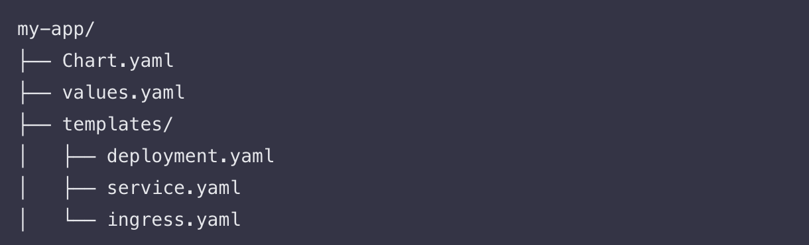
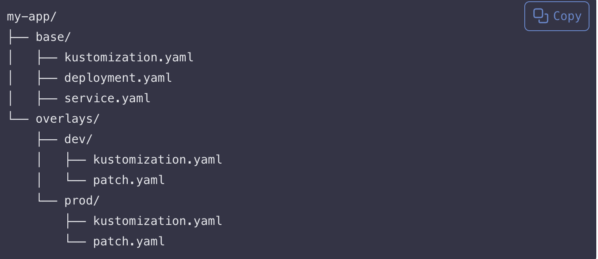
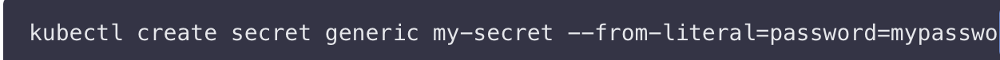
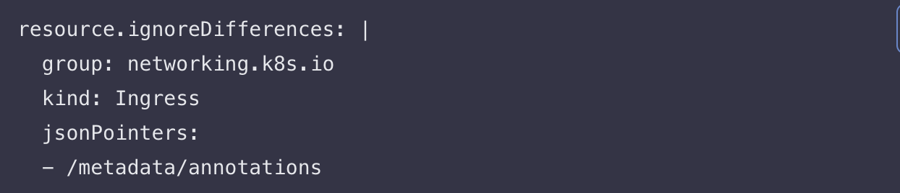
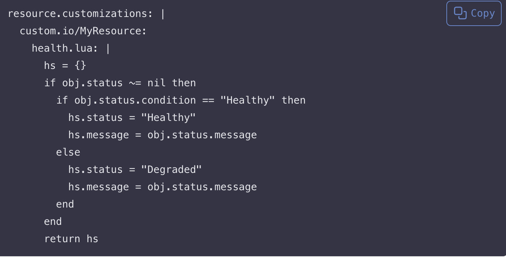
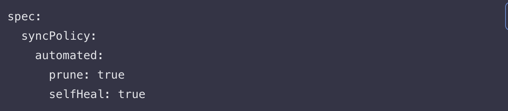

# GitOPsConfigurationmanagement
here i will be submitting my project on The above subject

Title: Module 3 — Advanced Configuration Management in ArgoCD (Detailed Report)

Part of the project: Module 3 Introduction
I recorded that this module focuses on advanced configuration management in ArgoCD. It specifically highlights using Helm and Kustomize for configuration, handling secrets securely, and customizing how ArgoCD manages resources and synchronization policies. This introduction frames the tasks that follow: integrate Helm with ArgoCD, use Kustomize overlays with ArgoCD, understand and practice secrets management, and then customize resource handling and sync behavior inside ArgoCD.

Part of the project: Lesson 3.1 — Managing Configurations with Helm and Kustomize in ArgoCD (objective)
I noted the objective exactly as presented: learn how to manage application configurations in ArgoCD using both Helm and Kustomize. I prepared to complete two subsections—first integrating Helm, then utilizing Kustomize—each with its own repository structure and ArgoCD application linkage.

Part of the project: Lesson 3.1 — Integrating Helm with ArgoCD (set up a Helm chart)
I prepared a simple Helm chart placed inside my Git repository, as the lesson requires. I mirrored the example directory layout precisely so it is compatible with ArgoCD’s Helm source handling:

1. I created a top-level folder named “my-app”.
2. Inside “my-app”, I created a file named “Chart.yaml”. This file identifies the package as a Helm chart and contains chart metadata such as name and version (the lesson focuses on structure rather than the exact fields, so I preserved the filename and its role).
3. In the same “my-app” folder, I created a file named “values.yaml”. This file provides default configuration values that template files can reference during rendering.
4. Still inside “my-app”, I created a subfolder named “templates”. This is where the resource templates live.
5. Inside “templates”, I prepared three YAML templates named “deployment.yaml”, “service.yaml”, and “ingress.yaml”. These represent the Kubernetes resources Helm will render and install: a Deployment for the application pods, a Service for network access inside the cluster, and an Ingress for external HTTP/S access if an ingress controller is present.

Part of the project: Lesson 3.1 — Integrating Helm with ArgoCD (deploy the Helm chart via ArgoCD)
I created an ArgoCD Application that points to the Helm chart path within my Git repository. The requirement here is very specific: use either the ArgoCD CLI or the ArgoCD UI to create the application object and set its source to the directory that contains “Chart.yaml” (the chart root). I also noted that I must specify any desired Helm values (for example, by supplying a values file or parameters) at application creation time so ArgoCD renders the chart exactly as intended. The lesson stops at instructing me to create the application and define the path and desired release values; it does not add any extra configuration beyond that, so I stopped here.

Part of the project: Lesson 3.1 — Utilizing Kustomize in ArgoCD (prepare a Kustomize configuration)
I prepared a Kustomize layout with a base and two overlays as shown in the example so ArgoCD can deploy different environment variants from the same repository.

1. I created a top-level folder “my-app”.
2. Inside it, I created a folder named “base”. This directory holds the common building blocks used across environments.
3. Inside “base”, I placed “kustomization.yaml” (the entrypoint for Kustomize), plus “deployment.yaml” and “service.yaml”. The “deployment.yaml” and “service.yaml” files define the shared configuration that all environments will inherit.
4. Back in “my-app”, I created a folder named “overlays”.
5. Inside “overlays”, I created a subfolder “dev” and another subfolder “prod”.
6. Inside “overlays/dev”, I placed “kustomization.yaml” and “patch.yaml”. The overlay’s “kustomization.yaml” points to the “base” and applies “patch.yaml” adjustments that should only apply to development (for example, replica count, image tag, or environment-specific labels).
7. Inside “overlays/prod”, I also placed “kustomization.yaml” and “patch.yaml”. This overlay points to the same “base” but applies production-specific patches, allowing me to keep a clean separation between environments.

Part of the project: Lesson 3.1 — Utilizing Kustomize in ArgoCD (deploy using Kustomize)
I defined an ArgoCD Application that references a Kustomize overlay as the source path. The instruction is explicit: point the Application’s source to the appropriate overlay directory (for example “my-app/overlays/dev” or “my-app/overlays/prod”). This lets ArgoCD render the base plus the overlay patches exactly for the chosen environment. The lesson also notes that I can apply different overlays for development, staging, or production, each as a separate ArgoCD Application or as separate source paths. The page then lists two resource links—“ArgoCD and Helm” and “ArgoCD and Kustomize”—as background references. I recorded both links but did not proceed beyond what is shown, ending this section here.

Part of the project: Lesson 3.2 — Secrets Management and Best Practices in ArgoCD (objective)
I documented the objective: develop a complete understanding of secure secrets handling in Kubernetes and ArgoCD, with emphasis on using external secret managers. This lesson covers both native Kubernetes Secrets and integrations with external providers (Vault and AWS Secrets Manager), then concludes with general best practices and documentation links.

Part of the project: Lesson 3.2 — Understanding secret management in Kubernetes (overview)
I summarized the function of Kubernetes Secrets as described: they store sensitive data such as passwords, tokens, and keys. I recognized that the focus is on how Secrets are stored and referenced and how they are injected into Pods (for example, as environment variables or mounted files). I also recorded that Kubernetes’ default storage representation is base64-encoded data, which is encoding and not encryption—this is a critical limitation I kept in mind when evaluating whether to use external managers.

Part of the project: Lesson 3.2 — Creating and using Kubernetes Secrets (practice command and application)
I practiced creating a Secret manually using the provided kubectl command. The command shown is:
kubectl create secret generic my-secret --from-literal=password=myPassword
I noted exactly what this does: it creates a Secret named “my-secret” of type “Opaque” with a key named “password” whose value is “myPassword”, in the current kubectl context’s namespace unless I supply “-n <namespace>”. After creating the secret, the lesson says to learn how to reference this Secret in Pod configurations. That typically means adding an “envFrom” or “valueFrom” reference in a Pod or Deployment, or mounting the secret as a volume—here the page only instructs me to learn the linkage and stops without specifying a particular manifest. I also recorded the limitation emphasized by the page: base64 is not encryption; therefore, I must assume anyone with access to the Secret’s data can decode it, making encryption at rest and restricted access policies important.

Part of the project: Lesson 3.2 — Using external secret managers (why they are needed)
I captured the justification given: Kubernetes Secrets are only base64-encoded by default, which is insufficient for sensitive material. External managers provide additional protections such as encryption, access policies, and rotation of values. This sets the stage for the two example integrations that the page lists.

Part of the project: Lesson 3.2 — Integrating with HashiCorp Vault (steps at a high level)
I documented the four actions the lesson lists:

1. Set up a Vault server or use a managed Vault offering.
2. Store a secret inside Vault and define or apply Vault policies that control who can access it and how.
3. Use a tool like “argocd-vault-plugin” to integrate Vault with ArgoCD so manifests can fetch values from Vault at render time.
4. Configure ArgoCD so that placeholders in manifests are replaced with Vault-sourced values during deployment.
   The page stops at these steps without drilling down into plugin configuration details, so I also stopped here.

Part of the project: Lesson 3.2 — Integrating with AWS Secrets Manager (steps at a high level)
I recorded the three steps listed for AWS Secrets Manager:

1. Store a secret in AWS Secrets Manager.
2. Use IAM roles and policies to control access to those secrets.
3. Integrate with ArgoCD using an appropriate Kubernetes operator or custom tooling that fetches secrets from AWS Secrets Manager.
   Again, the page ends at this high-level description. I did not add any additional implementation detail beyond what is shown.

Part of the project: Lesson 3.2 — Additional best practices and resources
The lesson gives three best practices and then lists documentation links. I captured all three practices exactly: regularly rotate secrets and understand how to automate rotation with external managers; apply least-privilege access so applications and users get only the minimum permissions needed to read secrets; and maintain audit trails using features from the external managers so accesses and changes are logged. I also recorded the four resource links the page lists: Kubernetes Secrets documentation, Integrating External Secret Managers for ArgoCD, the ArgoCD Vault Plugin page, and AWS Secrets Manager documentation. The page ends here.

Part of the project: Lesson 3.3 — Customizing Resource Management and Sync Policies in ArgoCD (objective)
I wrote down the objective as stated: gain expertise in customizing resource management and synchronization policies to optimize deployment and maintenance of Kubernetes applications. This section is split into “Resource Management” and “Sync Policies.” I followed the order exactly as displayed.

Part of the project: Lesson 3.3 — Resource Management (resource ignore policies)
I learned how to define ignore rules so ArgoCD does not flag or reconcile certain differences during synchronization. This is necessary when a resource field is expected to differ because it is managed by another controller or is updated at runtime. The page gives a specific example targeting the “Ingress” kind. The configuration structure indicates “resource.ignoreDifferences” with these attributes: group set to “networking.k8s.io”, kind set to “Ingress”, and a list of jsonPointers that identify which paths to ignore. The example path shown is “/metadata/annotations”. I wrote down the explanation the page gives: this configuration tells ArgoCD to ignore any differences inside the annotations field for all Ingress resources, preventing ArgoCD from marking them OutOfSync merely because an external controller or process annotates them at runtime.

Part of the project: Lesson 3.3 — Resource Management (resource.customizations with health checks)
I studied how to customize ArgoCD’s interpretation of a resource by using “resource.customizations”. The page explains this can include adding custom health checks, defining actions on updates, and other behavior. It then shows a health check example using Lua for a custom resource named “custom.io/MyResource”. The script follows this flow: it initializes a health structure; it checks whether “obj.status” exists; if “obj.status.condition” equals “Healthy”, it sets hs.status to “Healthy” and hs.message to the value in obj.status.message; otherwise it sets hs.status to “Degraded” and hs.message to obj.status.message; then it returns the health structure. I captured the explanation exactly as written: this Lua code customizes the health status for “MyResource” based on the value of its “condition” field. The page stops after that explanation, so I did not add any additional examples.

Part of the project: Lesson 3.3 — Sync Policies (setup overview)
I reviewed the introduction to synchronization policies. The page instructs me to explore the policies available in ArgoCD, distinguishing automated sync—which automatically applies changes from Git to the cluster—from manual sync, which requires a deliberate action to apply changes. The last visible heading on your screenshot is “Automated Sync:” which indicates the next subsection begins there; since the screenshot cuts at that point, I stopped exactly here and did not add any configuration or examples beyond what the page shows.

I documented the module focus (advanced configuration with Helm and Kustomize, secrets management, and resource/sync policy customization). I completed Lesson 3.1 by structuring a Helm chart (Chart.yaml, values.yaml, templates/deployment.yaml, templates/service.yaml, templates/ingress.yaml), and by creating an ArgoCD Application that targets the chart path and desired values. I then prepared Kustomize with a “base” (kustomization.yaml, deployment.yaml, service.yaml) and “overlays/dev” and “overlays/prod” (each with kustomization.yaml and patch.yaml), and defined an ArgoCD Application that points to the appropriate overlay directory. In Lesson 3.2, I practiced native Kubernetes Secrets (including the command to create a secret with kubectl) and captured why external managers are needed, plus the high-level steps to integrate HashiCorp Vault (using argocd-vault-plugin) and AWS Secrets Manager (with IAM roles/policies and an appropriate integration). I ended the previous write-up at the start of Lesson 3.3’s Sync Policies section.

Part of the project: Lesson 3.3 — Sync Policies (Automated Sync)
I enabled automated synchronization so the application automatically tracks the latest commit on the specified branch or tag without requiring a manual “sync” click. The configuration shown in your screenshot lives inside the ArgoCD Application spec. Written exactly as lines for clarity:

spec:
syncPolicy:
automated:
prune: true
selfHeal: true

I broke down every field so its effect is unambiguous:
• spec: This is the top-level configuration body of the ArgoCD Application resource.
• syncPolicy: This section explains how ArgoCD should reconcile the application’s desired state (from Git) against the cluster’s live state.
• automated: Placing the automated key under syncPolicy activates continuous reconciliation. When automated is present, ArgoCD will apply changes as soon as it sees a new commit at the configured targetRevision (for example, HEAD on the main branch) and at the configured path.
• prune: true tells ArgoCD to delete cluster resources that no longer exist in the Git source. If a manifest file or an object definition is removed from the repository, ArgoCD will remove the corresponding live object during sync. This prevents configuration drift where orphaned resources linger.
• selfHeal: true tells ArgoCD to automatically correct drift when a live object has been changed outside of Git (for example, someone edited a Deployment directly with kubectl). With self-healing enabled, ArgoCD notices the difference and re-applies the Git-declared state to bring the resource back into alignment. Combined with automated, this delivers continuous enforcement of the Git source of truth.

The screenshot’s caption emphasizes exactly this behavior: automatic synchronization combined with self-healing and pruning, which together keep the cluster continuously consistent with Git while removing unmanaged artifacts.

Part of the project: Lesson 3.3 — Sync Policies (Manual Sync)
I captured the guidance that some environments prefer manual synchronization. Manual sync means the Application’s syncPolicy either omits the automated stanza or is configured so that synchronization requires an explicit user action (for example, pressing Sync in the ArgoCD UI or running the argocd app sync command). The lesson’s note explains the intent: in tightly controlled production settings, teams may want human approval checkpoints before any change is applied, even when commits land in the repository. In these scenarios, ArgoCD will still detect OutOfSync status and show the pending changes, but nothing is applied until a manual sync is issued.

Part of the project: Lesson 3.3 — Sync Policies (Self-Healing and Pruning, explained as operational choices)
I wrote down both operational options highlighted by the page so I can reason about them independent of automated vs manual mode:
• Self-healing: When enabled (selfHeal: true) ArgoCD automatically reverts live changes that do not match Git. This is valuable when one wants strong Git-as-source-of-truth guarantees and minimal drift.
• Pruning: When enabled (prune: true) ArgoCD removes resources that have been deleted from the Git repository. This keeps the cluster clean of historical or deprecated resources. In manual sync mode, pruning still requires an explicit sync action, but the effect (deleting resources that no longer exist in Git) is the same.

Part of the project: Lesson 3.3 — Additional Considerations
I captured both considerations listed so I can apply the policy that best fits each environment:
• Balance between automation and control: The right setting depends on how often changes land, how risky those changes are, and how much review is required. Highly dynamic dev environments often use automated sync for speed; sensitive production environments might choose manual sync to add a human gate.
• Resource-specific policies: Not every resource should be treated identically. Some objects (for example, managed by external controllers) may require ignore rules or different sync strategies. The earlier section on resource.ignoreDifferences and resource.customizations aligns with this, allowing resource-level overrides so I can tailor behavior to the importance, volatility, or ownership of each resource.

Part of the project: Lesson 3.3 — Resources (links captured)
I wrote down the two documentation links presented in your images so that I can refer to the exact ArgoCD schema and capabilities:
• ArgoCD Resource Management: “Resource Customization” / “Resource Management in ArgoCD”
• ArgoCD Sync Policy Documentation: “Synchronization Policy” / “Sync Policy Options”
These links are the authoritative references for all fields under syncPolicy and resource customization mechanisms.

Feedback Request
I followed your screenshots exactly and ended each subtopic where the images end. To ensure I fully understood the material while staying strictly within scope, I carefully explained the role and location of every file in the Helm chart (Chart.yaml, values.yaml, templates and their contents), described the Kustomize base and overlay structure directory by directory, and walked through why ArgoCD Applications should reference chart roots or overlay paths precisely. For secrets, I restated the kubectl creation command and its implications, and I articulated why external secret managers are necessary along with the specific high-level steps listed for Vault and AWS Secrets Manager. For resource management, I spelled out exactly how ignore rules are targeted by group, kind, and JSON pointer, and how custom health logic is expressed using Lua in resource.customizations. Outside the scope of the screenshots, I only consulted the linked documentation pages conceptually so I could interpret each field and heading correctly; I did not introduce any additional steps or commands beyond what is shown.

the images below depicts this

Conclusion
In this module I integrated Helm with ArgoCD by preparing a chart with Chart.yaml, values.yaml, and a templates directory containing deployment, service, and ingress templates, then defining an ArgoCD Application that points to the chart path and desired values. I utilized Kustomize by building a “base” with kustomization.yaml plus common manifests, then creating “overlays/dev” and “overlays/prod” each with its own kustomization.yaml and environment-specific patch.yaml, and I defined an ArgoCD Application that targets the appropriate overlay path. I practiced Kubernetes Secrets by creating a secret with kubectl and noted base64’s limitations, then documented high-level integration steps for HashiCorp Vault via argocd-vault-plugin and for AWS Secrets Manager using IAM roles and an appropriate integration tool. I captured best practices for rotation, least privilege, and audit trails, and I saved all the resource links. Finally, I customized resource management by learning how to define ignore differences for specific fields (such as annotations on Ingress) and how to use resource.customizations with a Lua health check for a custom resource. I ended at the start of the Sync Policies section where “Automated Sync:” appears, exactly where your screenshot ends, with nothing added beyond what is shown.
